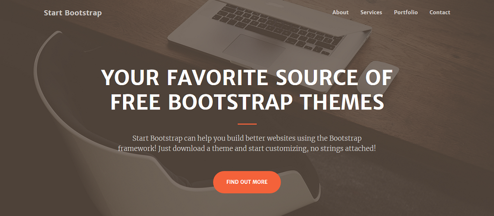

# Neo Store

The "Neo Geo" (meaning "New Land") is a video game console that was popular from the early 90's until the mid 00's. As well as being a home console, the Neo Geo was also a very popular arcade machine. After the downturn in the arcade industry in the mid to late 00's, many fans bought up the Neo Geo arcade machines to have in their own homes.

This website serves the group of people who own their own Neo Geo arcade machine by providing them with a central hub where they can purchase spare parts when the need arises. Because of the popularity of the machine as well as the age, there is a large and growing market for spare parts.

Although there are many websites that sell parts for arcade machines, these sites tend to sell generic parts that are either unsuitable for Neo Geo machines or of poor quality. Neo geo collectors tend to favor parts of high quality. This site ensures that the needs of a Neo Geo colector are met whilst ensuring that the parts purchased will fit the machines without issue.
 
## UX
 
**Website goal:**

The site is designed to be a central hub where Neo Geo collectors can come and find any spare parts they may need. Users will benefit from having all of the parts in one place as well as having access to advise from the website owner such as part size and recommendation information. The website owner benefits by gaining pleasure from helping collectors as well as earning profit from every sale.

Users will be able to purchase:

- Buttons
- Joysticks
- Replacement side art
- Replacement marquees
- Coin mechanisms
- Screen surrounds
- Power supplies
- Game cartridges
- Game storage boxes
- Paint
- Cleaning supplies

## User Stories ##

**User story 1:**

As a person interested in getting involved in the hobby, I browsed the website to get a feel of prices. I now know that it is a hobby I could get into.

**User story 2:**

A a Neo Geo arcade machine owner who's machine needed new buttons, I was able to search the website to find new buttons. After paying with my credit card, the buttons were shipped to my home.

**User story 3:**

As a Neo Geo collector who needed a new power supply for my machine, I was able to fill out the question form to ask which specific power supply was needed for my particular model of machine. Once the question was answered, I was able to order the correct power supply from the website.

**User story 4:**

As a Neo Geo collector, I was able to fill out the request form for a part which I needed that was not listed in the catalogue. The site owner informed me when the part would be in stock and I was then able to order it from the website.

**Wireframes**

**Creative**

An attractive one page Bootstrap theme perfect for creative portfolios and businesses

*Image 1. The Creative theme*

## Features

**Request**

Request a new part to be held in stock.

**Question form**

A user will be able to fill out a form should they have any queries regarding a certain part such as measurements and compatibility questions.

**Secure**

Uses Stripe to handle credit card tasks.

**Responsive**

The shop is easy to browse across multiple devices and platforms from desktop to mobile.

**Browse all items**

**Review the store**

**Leave a review on a product**
 
### Existing Features

## Directory structure

Descrive the directory structure of the project with diagram

### Features Left to Implement

- Users can choose their currency
- Users can leave a review of the website
- Sort items by price, date listed

## Django Apps ##

Neo Store

Part

Request

Question

Accounts

## Models ##

**Part:**
- Name (char field)
- Description (text field)
- Price (decimal field)
- Picture (image field)
- Date entered (DateField)
- User review (text field)

## Key code explanations ##

## Technologies Used

The website utilises a heavily modified version of the "Accounts" Django app created by Code Institute as part of the tutorial series "Authentication and Authorisation". 

[https://github.com/Code-Institute-Solutions/AuthenticationAndAuthorisation](https://github.com/Code-Institute-Solutions/AuthenticationAndAuthorisation)

**Forms Bootstrap**

**Django**

A Python based web framework

Version: 3.0.3

[https://www.djangoproject.com/](https://www.djangoproject.com/)

**Visual Studio Code**

**Languages**

HTML5, Javascript, CSS, Python

**Paint.Net**

To retouch product photographs.

[https://www.getpaint.net/](https://www.getpaint.net/)

**Travis**

[https://travis-ci.com/](https://travis-ci.com/)

**Stripe**

[https://stripe.com/](https://stripe.com/)

**GitHub**

[https://github.com/](https://github.com/)

**Pillow 7.0.0**

For image processing used version 7.0.0 of Pillow. Pillow is a Python imaging

Python Imaging Library (abbreviated as PIL) (in newer versions known as Pillow) is a free library for the Python programming language that adds support for opening, manipulating, and saving many different image file formats.

[https://pypi.org/project/Pillow/](https://pypi.org/project/Pillow/)

## Testing

**Testing with Jasmine?**

**Continuous testing with Travis**

**Testing models with Django test framework**

Details of the test cases on Part model

**Stakeholder testing**

1. Contact form:
    1. Go to the "Contact Us" page
    2. Try to submit the empty form and verify that an error message about the required fields appears
    3. Try to submit the form with an invalid email address and verify that a relevant error message appears
    4. Try to submit the form with all inputs valid and verify that a success message appears.

**Testing the store on various devices / emulators / browsers**

**Bugs found / issues**

## Deployment

**Running the website locally**

Give details on the development webserver bundled with Django.

If one wanted to run the website from downloading the GitHub repository zip they would...

Uses SQLite database for development and testing (not suitable for production)

**How the website was deployed on Heroku**

## Credits

The Code Institute team

Spencer Barriball

Code Institute students on Slack

## Sources of information

Django documentation v3.0:

[https://docs.djangoproject.com/en/3.0/](https://docs.djangoproject.com/en/3.0/)

Code Institute tutorials....

**Start Bootstrap**

Theme templates.

[https://startbootstrap.com/](https://startbootstrap.com/)

### Content
- The text for section Y was copied from the [Wikipedia article Z](https://en.wikipedia.org/wiki/Z)

### Media
- The photos used in this site were obtained from ...

### Acknowledgements

- I received inspiration for this project from X

# TODO / Notes

* Change DEBUG = True in Django settings file to False
* Add a tonne of tests in tests.py on the part model
